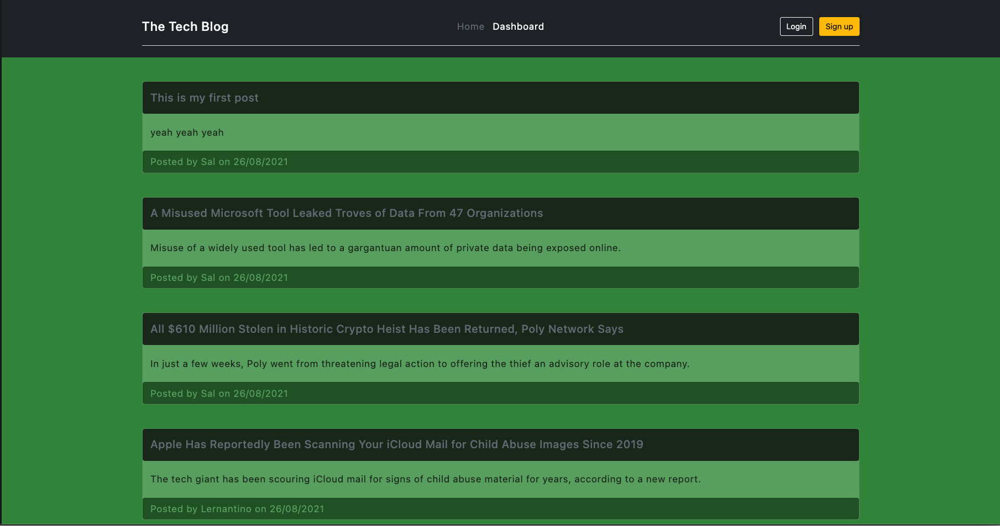

# tech-blog

## <h2 id="description"> Description </h2>

A web application that allows user to publish and add comments to blog posts. It uses Express.js API in conjunction with Sequelize to interact with a MySQL database. The final application is deployed on Heroku.

### <h3 id="preview"> Preview </h3>

The end product should resemble the mock-up provided below:

## <h2 id="table-of-contents"> Table of Contents </h2>

- [Description](#description)
- [Installation](#installation)
- [Usage](#usage)
- [License](#license)

## <h2 id="installation"> Installation </h2>
[(Back to top)](#table-of-content)

If you would like to work on a copy of this web application, you can follow these steps to set it up.

### Step 1: Load and install all dependencies

To use this project, first clone the repo on your device using the commands below:

    git clone https://github.com/Supasiti/tech-blog.git

Then install all the required libraries by running the follow command

    npm i 

### Step 2: Setting up MySQL

After installing all the dependencies, you would need to set up MySQL. An instruction on how to do this on your local computer can be found [here](https://www.mysql.com). After setting up MySQL, you would need to set up your local environment variables. On the root folder, create and open `.env` file:

    retail-store> touch .env
    retail-store> open .env

In the `.env` file, enter all the following details:

    DB_USER=root
    DB_NAME=blog_db
    DB_PASSWORD=<YOUR-OWN-PASSWORD>
    SESS_SECRET=<YOUR-SECRET>

Once this `.env` file is set up. Run the following command to initialise the database schema and seed sample data.

    node run setup

### Optional Set Up

You can run the following command to add any additional development dependencies:

    npm i --save-dev

## <h2 id="usage"> Usage </h2>
[(Back to top)](#table-of-content)

The access point for the appliction is in the main folder. The application can be run locally by the following commands:

    cd ~/pathTo/tech-blog
    npm start

The main application is deployed in Heroku, [here](https://supa-tech-blog.herokuapp.com) 

## <h2 id="license"> License </h2>
[(Back to top)](#table-of-content)

Licensed under the [MIT](https://opensource.org/licenses/MIT) license.